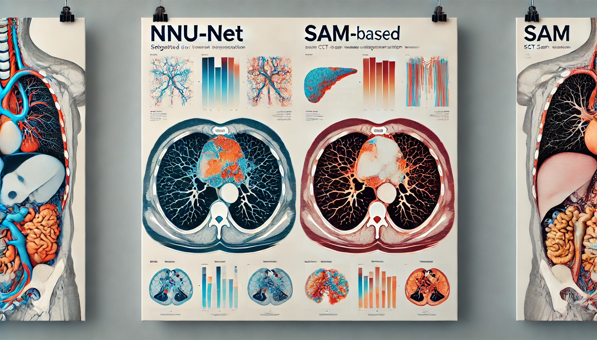

# CT scan image segmentation: nnUnet vs finetuning SAM

<table align="center">
  <tr align="center">
      <td></td>
  </tr>
  <tr align="center">
      <td><em>Image generated by DALL-E 2</em></td>
  </tr>
</table>

## Introduction
The code for reproducing our paper "". We experiment with different SAM based methods and more standard methods like Enet and nnUnet on the SEGHOR dataset. Short description of our main findings

## Quick Start

### Installation instructions

Get the code:
```bash
git clone https://github.com/WouterBant/AI4MI.git
```

We use conda for package management, create an environment with:
```bash
conda env create -f env.yml
```

Activate this environment to run the code without dependency problems:
```bash
conda activate ai4mi
```

### Getting the pretrained checkpoints
It is possible to obtain the checkpoints of all models of which results are presented in the paper with this command.

[checkpoints/download_checkpoints.sh](checkpoints/download_checkpoints.sh) contains commands to download the various models.

By default all commands are commented, uncomment the ones you are interested, cd into the checkpoints folder, and run:

```bash
bash download_checkpoints.sh
```

### Running the code

Run training with:
```bash
python src/main.py
```

<details> <summary>Click to expand full usage </summary>

```bash
usage: main.py [-h] [--epochs EPOCHS] [--lr LR] [--weight_decay WEIGHT_DECAY] [--batch_size BATCH_SIZE] [--gradient_accumulation_steps GRADIENT_ACCUMULATION_STEPS] [--use_scheduler] [--use_sampler] [--augment] [--model MODEL] [--optimizer {adam,sgd,adamw,sgd-wd}]
               [--dataset {TOY2,SEGTHOR,SEGTHOR_MANUAL_SPLIT}] [--mode {partial,full}] [--loss {ce,dice_monai,gdl,dce}] [--ce_lambda CE_LAMBDA] [--dest DEST] [--r R] [--from_checkpoint FROM_CHECKPOINT] [--gpu] [--num_workers NUM_WORKERS] [--debug] [--normalize] [--deterministic]
               [--use_wandb] [--clip_grad] [--crf] [--finetune_crf]

options:
  -h, --help            show this help message and exit
  --epochs EPOCHS
  --lr LR               Learning rate
  --weight_decay WEIGHT_DECAY
                        Weight decay
  --batch_size BATCH_SIZE
                        Batch size
  --gradient_accumulation_steps GRADIENT_ACCUMULATION_STEPS
                        Number of steps to accumulate gradients over
  --use_scheduler       Use CosineWarmupScheduler
  --use_sampler         Use AdaptiveSampler
  --augment             Augment the training dataset
  --model MODEL         Model to use
  --optimizer {adam,sgd,adamw,sgd-wd}
                        Optimizer to use
  --dataset {TOY2,SEGTHOR,SEGTHOR_MANUAL_SPLIT}
  --mode {partial,full}
  --loss {ce,dice_monai,gdl,dce}
  --ce_lambda CE_LAMBDA
  --dest DEST           Destination directory to save the results (predictions and weights).
  --r R                 The rank of the LoRa matrices.
  --from_checkpoint FROM_CHECKPOINT
  --gpu
  --num_workers NUM_WORKERS
  --debug               Keep only a fraction (10 samples) of the datasets, to test the logic around epochs and logging easily.
  --normalize           Normalize the input images
  --deterministic       Make the training deterministic
  --use_wandb           Use wandb for logging
  --clip_grad           Enable gradient clipping
  --crf                 Apply CRF on the output
  --finetune_crf        Freeze the model and only train CRF and the last layer
```
</details>

<br>

And evaluation with:

```bash
python src/test.py --from_checkpoint [your_checkpoint]
```
<details> <summary>Click to expand full usage </summary>

<br>

Note that for the compiled models a GPU is required to run inference as the model needs to be comiled again.

```bash
usage: test.py [-h] [--batch_size BATCH_SIZE] [--model MODEL] [--dest DEST] [--r R] [--dataset {TOY2,SEGTHOR,SEGTHOR_MANUAL_SPLIT}] [--mode {partial,full}] [--from_checkpoint FROM_CHECKPOINT] [--gpu] [--num_workers NUM_WORKERS] [--debug] [--normalize]

options:
  -h, --help            show this help message and exit
  --batch_size BATCH_SIZE
                        Batch size
  --model MODEL         Model to use
  --dest DEST           Destination directory to save the results (predictions and weights).
  --r R                 The rank of the LoRa matrices.
  --dataset {TOY2,SEGTHOR,SEGTHOR_MANUAL_SPLIT}
  --mode {partial,full}
  --from_checkpoint FROM_CHECKPOINT
  --gpu
  --num_workers NUM_WORKERS
  --debug               Keep only a fraction (10 samples) of the datasets, to test the logic around epochs and logging easily.
  --normalize           Normalize the input images
```
</details>


## Our contributions
make links to the most important files, like:
- Notebook showing how we were able to fix the data (with and without the provided transformation matrix) and are able to work with nifti files: [notebooks/heart_transform](notebooks/heart_transform.ipynb), this is incorporated in [slice_seghtor.py](src/slice_segthor.py).
- Implementation of by us chosen metrics: [src/metrics.py](src/metrics.py).
- Notebooks for [interpretability](notebooks/intepretability.ipynb) (and its [code](notebooks/notebook_utils.py)), [image normalization visualization](notebooks/normalize.ipynb), [augmentation visualization](notebooks/augmentations.ipynb), and [data analysis](notebooks/data_analysis.ipynb) can be found in the [notebooks/](notebooks) folder.


## Acknowledgements
This was part of a project for the course AI for Medical Imaging (2024) at the University of Amsterdam. Some base code was provided: https://github.com/HKervadec/ai4mi_project. 

- SAM: https://github.com/facebookresearch/segment-an
- Implementation for LoRA for SAM: https://github.com/JamesQFreeman/Sam_LoRA
- We further adopted parts of the code of samed who also fine-tuned SAM for medical image segmentation: https://github.com/hitachinsk/SAMed

We started of from https://github.com/JamesQFreeman/Sam_LoRA and committed changes from there on. Note that some of these changes come directly from https://github.com/hitachinsk/SAMed.

The key difference between our work and of https://github.com/hitachinsk/SAMed comes from changes we don't make + we use 'masks' instead of 'low_res_logits'.

