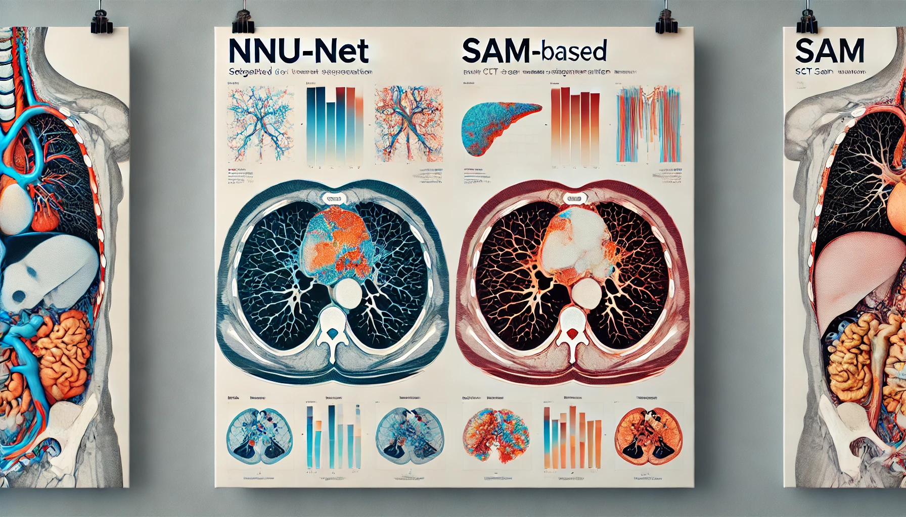

[](https://pytorch.org/) [](https://www.python.org/downloads/)  [](https://github.com/WouterBant/AI4MI/blob/main/LICENSE) 

# CT scan image segmentation: nnUnet vs finetuning SAM 

<table align="center">
  <tr align="center">
      <td></td>
  </tr>
  <tr align="center">
      <td><em>Image generated by DALL-E 2</em></td>
  </tr>
</table>

## Introduction
The code for reproducing our paper "Thoracic Organ-at-Risk Segmentation: A Case Study with SAM, ENet, and nnU-Net Models". We experiment with different SAM based methods and more standard methods like Enet and nnUnet on the SEGTHOR dataset. We find that SAM based models can outperform ENet models but nnU-Net was superior across various settings. The obtained results can be found [here](results) and can be converted to npy files with [csv2npy.py](results_metrics/csv2npy.py).

## Quick Start

### Installation instructions

Get the code:
```bash
git clone https://github.com/WouterBant/AI4MI.git
```

We use conda for package management, create an environment with:
```bash
conda env create -f env.yml
```

Activate this environment to run the code without dependency problems:
```bash
conda activate ai4mi
```

### Getting the pretrained checkpoints
It is possible to obtain the checkpoints of all SAMed models. [checkpoints/download_checkpoints.sh](checkpoints/download_checkpoints.sh) contains commands to download the various models. By default all commands are commented, uncomment the ones you are interested and run:

```bash
bash checkpoints/download_checkpoints.sh
```

For future reference: when training a model with `torch.compile` save models with [`torch.save(getattr(model, '_orig_mod', model).state_dict(), "best_weights.pt")`](https://github.com/pytorch/pytorch/issues/101107). Now we removed the _orig_mod prefixes with [fix_checkpoints.py](checkpoints/fix_checkpoints.py). This was done to be able to load models without compiling (which is not possible on CPU and the overhead of JIT outweighs its performance increase for inference on small datasets).

### Running the code

> **Note that for running the SAM based models you also need the checkpoints released by Meta**. These download commands can also be found in [checkpoints/download_checkpoints.sh](checkpoints/download_checkpoints.sh) and [src/download.sh](src/download.sh).

Run training with:
```bash
python src/main.py
```

When using the optional `wandb` flag make sure to export your api key with:

```bash
export WANDB_API_KEY="Your key here"
```

<details> <summary>Click to expand full usage </summary>

```bash
usage: main.py [-h] [--epochs EPOCHS] [--lr LR] [--weight_decay WEIGHT_DECAY] [--batch_size BATCH_SIZE] [--gradient_accumulation_steps GRADIENT_ACCUMULATION_STEPS] [--use_scheduler] [--use_sampler] [--augment] [--augment_nnunet] [--model MODEL] [--hiera_path HIERA_PATH] [--optimizer {adam,sgd,adamw,sgd-wd}]
               [--dataset {TOY2,SEGTHOR,SEGTHOR_MANUAL_SPLIT}] [--mode {partial,full}] [--loss {ce,dice_monai,gdl,dce}] [--ce_lambda CE_LAMBDA] [--dest DEST] [--r R] [--from_checkpoint FROM_CHECKPOINT] [--gpu] [--num_workers NUM_WORKERS] [--debug] [--normalize] [--deterministic] [--use_wandb] [--clip_grad] [--crf] [--finetune_crf]

options:
  -h, --help            show this help message and exit
  --epochs EPOCHS
  --lr LR               Learning rate
  --weight_decay WEIGHT_DECAY
                        Weight decay
  --batch_size BATCH_SIZE
                        Batch size
  --gradient_accumulation_steps GRADIENT_ACCUMULATION_STEPS
                        Number of steps to accumulate gradients over
  --use_scheduler       Use CosineWarmupScheduler
  --use_sampler         Use AdaptiveSampler
  --augment             Augment the training dataset
  --augment_nnunet      Augment the training dataset with nnUNet augmentations
  --model MODEL         Model to use
  --hiera_path HIERA_PATH
                        path to the sam2 pretrained hiera
  --optimizer {adam,sgd,adamw,sgd-wd}
                        Optimizer to use
  --dataset {TOY2,SEGTHOR,SEGTHOR_MANUAL_SPLIT}
  --mode {partial,full}
  --loss {ce,dice_monai,gdl,dce}
  --ce_lambda CE_LAMBDA
  --dest DEST           Destination directory to save the results (predictions and weights).
  --r R                 The rank of the LoRa matrices.
  --from_checkpoint FROM_CHECKPOINT
  --gpu
  --num_workers NUM_WORKERS
  --debug               Keep only a fraction (10 samples) of the datasets, to test the logic around epochs and logging easily.
  --normalize           Normalize the input images
  --deterministic       Make the training deterministic
  --use_wandb           Use wandb for logging
  --clip_grad           Enable gradient clipping
  --crf                 Apply CRF on the output
  --finetune_crf        Freeze the model and only train CRF and the last layer
```
</details>

<br>

Training nnU-Net was easily done by following instructions from their [README](src/nnUNet/readme.md).

Evaluation on 2D metrics with:

```bash
python src/test.py --from_checkpoint [your_checkpoint]
```

Or easier (uncomment the lines of SAMed models you want to test and make sure to download the corresponding checkpoint first):
```bash
bash test.sh
```

<details> <summary>Click to expand full usage </summary>

<br>

```bash
usage: test.py [-h] [--batch_size BATCH_SIZE] --model {samed,samed_fast,ENet,ensemble,SAM2UNet} [--hiera_path HIERA_PATH] [--dest DEST] [--r R] [--dataset {TOY2,SEGTHOR,SEGTHOR_MANUAL_SPLIT}] [--mode {partial,full}] [--from_checkpoint FROM_CHECKPOINT] [--gpu] [--num_workers NUM_WORKERS] [--debug] [--normalize] [--crf] [--finetune_crf]
               [--save_png]

options:
  -h, --help            show this help message and exit
  --batch_size BATCH_SIZE
                        Batch size
  --model {samed,samed_fast,ENet,ensemble,SAM2UNet}
                        Model to use
  --hiera_path HIERA_PATH
                        path to the sam2 pretrained hiera
  --dest DEST           Destination directory to save the results (predictions and weights).
  --r R                 The rank of the LoRa matrices.
  --dataset {TOY2,SEGTHOR,SEGTHOR_MANUAL_SPLIT}
  --mode {partial,full}
  --from_checkpoint FROM_CHECKPOINT
  --gpu
  --num_workers NUM_WORKERS
  --debug               Keep only a fraction (10 samples) of the datasets, to test the logic around epochs and logging easily.
  --normalize           Normalize the input images
  --crf                 Apply CRF on the output
  --finetune_crf        Freeze the model and only train CRF and the last layer
  --save_png            Save the predictions as PNG
```
</details>

<br> 

Evaluate with 3D metrics with:

```bash
python src/test3d.py
```

<details> <summary>Click to expand full usage </summary>

<br>

```bash
usage: test3d.py [-h] [--batch_size BATCH_SIZE] --model {samed,samed_fast,ENet,SAM2UNet} [--hiera_path HIERA_PATH] [--dest DEST] [--r R] [--include_background] [--dataset {TOY2,SEGTHOR,SEGTHOR_MANUAL_SPLIT}] [--mode {partial,full}] [--from_checkpoint FROM_CHECKPOINT] [--gpu] [--num_workers NUM_WORKERS] [--debug] [--normalize] [--crf]
                 [--finetune_crf]

options:
  -h, --help            show this help message and exit
  --batch_size BATCH_SIZE
                        Batch size
  --model {samed,samed_fast,ENet,SAM2UNet}
                        Model to use
  --hiera_path HIERA_PATH
                        path to the sam2 pretrained hiera
  --dest DEST           Destination directory to save the results (predictions and weights).
  --r R                 The rank of the LoRa matrices.
  --include_background  Include the background class in the metrics
  --dataset {TOY2,SEGTHOR,SEGTHOR_MANUAL_SPLIT}
  --mode {partial,full}
  --from_checkpoint FROM_CHECKPOINT
  --gpu
  --num_workers NUM_WORKERS
  --debug               Keep only a fraction (10 samples) of the datasets, to test the logic around epochs and logging easily.
  --normalize           Normalize the input images
  --crf                 Apply CRF on the output
  --finetune_crf        Freeze the model and only train CRF and the last layer
```
</details>

<br>

We found it easier to evaluate nnU-Net with the predicted logits rather than loading the model in our scripts. 3D evaluation is done with:
```bash
python src/test3dnnunet.py
```


<details> <summary>Click to expand full usage </summary>

<br>

```bash
usage: test3dnnunet.py [-h] [--batch_size BATCH_SIZE] [--dest DEST] [--folder FOLDER] [--dataset {TOY2,SEGTHOR,SEGTHOR_MANUAL_SPLIT}] [--mode {partial,full}] [--from_checkpoint FROM_CHECKPOINT] [--gpu] [--num_workers NUM_WORKERS] [--debug] [--normalize] [--crf] [--finetune_crf]

options:
  -h, --help            show this help message and exit
  --batch_size BATCH_SIZE
                        Batch size
  --dest DEST           Destination directory to save the results (predictions and weights).
  --folder FOLDER       Path to folder with predictions
  --dataset {TOY2,SEGTHOR,SEGTHOR_MANUAL_SPLIT}
  --mode {partial,full}
  --from_checkpoint FROM_CHECKPOINT
  --gpu
  --num_workers NUM_WORKERS
  --debug               Keep only a fraction (10 samples) of the datasets, to test the logic around epochs and logging easily.
  --normalize           Normalize the input images
  --crf                 Apply CRF on the output
  --finetune_crf        Freeze the model and only train CRF and the last layer
```
</details>


## Our contributions
- Notebook showing how we were able to fix the data (with and without the provided transformation matrix) and are able to work with nifti files: [notebooks/heart_transform](notebooks/heart_transform.ipynb), this is incorporated in [src/slice_seghtor.py](src/slice_segthor.py). (Wouter / Liang)
- Implementation of by us chosen metrics: [src/metrics.py](src/metrics.py) [src/metrics3d.py](src/metrics3d.py). (Jasper)
- [2D Inference](src/test.py), [General 3D Inference](src/test3d.py), and [3D nnU-Net Inference](src/test3dnnunet.py). (Jasper / Wouter)
- [Our version of SAMed](src/samed/), the most imporatant change is using `masks` instead of `low_res_logits` in the [training loop](src/main.py). (Wouter)
- [Cosine learning rate scheduler](src/scheduler.py). (Wouter)
- [CRF wrapper class for models](src/crf_model.py). (Sacha)
- [Adaptive sampler to downsample only background images](src/adaptive_sampler.py). (Sacha)
- [Wandb integration with uploading predicted segmentations during training](src/utils.py). (Wouter)
- Notebooks for [interpretability](notebooks/interpretability.ipynb) (and its [code](notebooks/notebook_utils.py)), [image normalization visualization](notebooks/normalize.ipynb), [augmentation visualization](notebooks/augmentations.ipynb), and [data analysis](notebooks/data_analysis.ipynb) alongside notebooks to generate all figures presented in our paper (and more) can be found in the [notebooks](notebooks) folder. (Sacha / Liang / Sacha / Jesse / Wouter)
- [Framework for Ensemble models](src/EnsembleModel.py) (results were not clear improvement so left out of paper). (Liang)
- Training and evaluating SAM2U-Net. (Liang)
- Training and evaluating nnU-Net. (Jesse)
- Training and evaluating (+hyperparameter search) ENet. (Jesse)

## Acknowledgements
This was part of a project for the course AI for Medical Imaging (2024) at the University of Amsterdam. Some base code was provided: https://github.com/HKervadec/ai4mi_project. 

- SAM: https://github.com/facebookresearch/segment-anything
- Implementation for LoRA for SAM: https://github.com/JamesQFreeman/Sam_LoRA
- We further adopted parts of the code of samed who also fine-tuned SAM for medical image segmentation: https://github.com/hitachinsk/SAMed
- nnU-Net: https://github.com/MIC-DKFZ/nnUNet
- Batchgenerators: https://github.com/MIC-DKFZ/batchgenerators
- SAM2-UNet: https://github.com/WZH0120/SAM2-UNet
- CRF: https://github.com/mishgon/crfseg